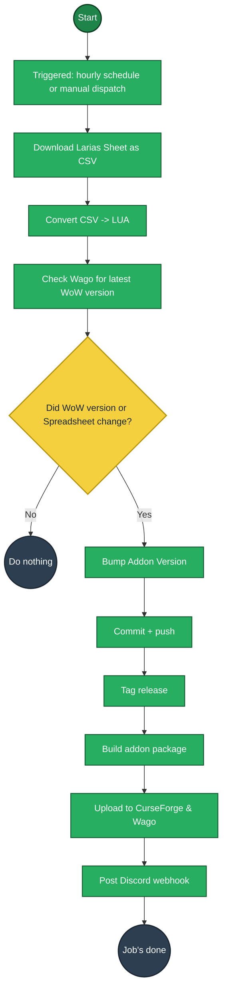

```mermaid
flowchart TD

    A((Start)):::start

    B[Triggered: hourly schedule or manual dispatch]:::process
    E[Download Larias Sheet as CSV]:::process
    F[Convert CSV -> LUA]:::process
    W[Check Wago for latest WoW version]:::process
    G{Did WoW version or Spreadsheet change?}:::decision
    H((Do nothing)):::finish
    I[Bump Addon Version]:::process
    J[Commit + push]:::process
    K[Tag release]:::process
    L[Build addon package]:::process
    M[Upload to CurseForge & Wago]:::process
    O[Post Discord webhook]:::process
    P((Job's done)):::finish

    B --> E --> F --> W --> G
    G -- No --> H
    G -- Yes --> I --> J --> K --> L --> M --> O --> P

    A --> B

classDef start fill:#1E8449,color:#FFFFFF,stroke:#0B3D1F,stroke-width:2px;
classDef process fill:#27AE60,color:#FFFFFF,stroke:#145A32,stroke-width:1.5px;
classDef decision fill:#F4D03F,color:#1B2631,stroke:#B7950B,stroke-width:2px;
classDef finish fill:#2C3E50,color:#FFFFFF,stroke:#1B2631,stroke-width:2px;


```
